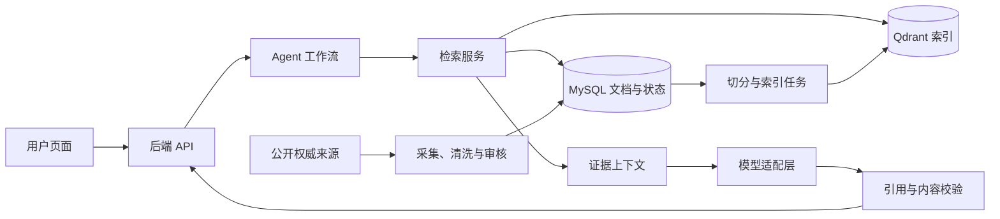

# Imm-Agent：癌症免疫疗法科普 Agent

面向公众、患者及家属，从零建设一个支持自然语言问答、术语解释、知识比较和来源追溯的癌症免疫疗法科普助手。

具体开发顺序、待办任务与阶段验收条件见 [开发任务清单](TODO.md)；从新电脑安装环境到日常开发的完整操作见 [跨平台开发工作流](docs/development-workflow.md)。

> 当前文档是项目规划，以下技术选型、接口与验收目标均为拟议方案，不代表已经实现。项目定位为知识科普，不提供个体化诊断、用药或治疗方案。

## 项目起点

本项目从空仓库开始实现，不复用或迁移任何旧网页、爬虫、代码和数据库。前端、后端、数据结构、资料采集、检索索引、评测集和部署配置都在本仓库内重新建设。

首批知识资料从允许使用的公开权威来源采集。每份资料在进入问答系统前都必须记录来源、机构、发布日期、采集日期、内容哈希和审核状态，无法追溯来源的内容不能成为回答证据。

## 预期功能：Imm-Agent

- **科普问答**：围绕免疫疗法的概念、作用机制、研究进展和常见问题生成易懂的回答。
- **多轮追问**：理解“它有哪些类型”“和上一种有什么区别”等上下文相关的问题。
- **术语解释**：识别中文名称、英文名称、缩写和常见别名，按用户理解程度组织内容。
- **知识比较**：按机制、研究背景和资料中描述的适用条件比较不同疗法，并保留条件与来源。
- **可追溯回答**：为关键事实提供引用、原文片段及资料日期；缺少可靠依据时明确说明。
- **知识维护**：支持导入、审核、更新和撤回资料，使新增知识进入检索系统。

建议先完成“首批资料建设 + RAG 问答 + 简单 Agent 工作流”。RAG 用于在回答时检索外部知识，Agent 用于控制检索和回答步骤；模型微调作为后续实验，用于改进解释风格或特定任务表现，不作为更新医学知识的主要方式。

## 核心技术栈

以下选型以从零实现、便于个人开发和逐步验证效果为前提。VibeCoding 与系统设计属于开发方法和工程能力，其他条目对应系统的具体组成部分。

| 技术方向 | 建议起点 | 阶段 |
| --- | --- | --- |
| AI Agent | Python 显式工作流，复杂后引入 LangGraph | 首版实现简单流程 |
| RAG | 文档切分、检索、证据约束生成和引用校验 | 首版必需 |
| 数据采集与知识治理 | Python 导入脚本、网页解析、增量更新与审核 | 首版必需 |
| Embedding 与检索排序 | 中英文向量模型、关键词检索；按评测引入 Reranker | 首版建立基线 |
| 大模型与提示词工程 | 可替换的模型 API 适配层、版本化提示词、结构化输出 | 首版必需 |
| 数据库 | MySQL 保存权威记录，Qdrant 保存检索索引 | 首版必需 |
| 知识图谱 | 先建设术语与关系表，再评估 Neo4j | 后续扩展 |
| 模型微调 | 高质量任务样本、监督微调、LoRA 实验 | 后续扩展 |
| 前后端 | React + TypeScript、FastAPI + Pydantic | 首版必需 |
| 评估与测试 | 固定问题集、pytest、人工评审，按需使用 Ragas | 首版必需 |
| 内容安全与隐私保护 | 证据检查、权限隔离、输入输出约束、日志脱敏 | 首版必需 |
| 部署与可观测性 | Docker Compose、结构化日志、持续集成 | 首版基础能力 |
| VibeCoding | 小步开发、代码审查、自动检查 | 全程使用 |
| 系统设计能力 | 模块边界、数据一致性、容错、成本与版本管理 | 全程使用 |

### AI Agent

**用途**：根据问题决定是否需要澄清、调用哪些检索工具，以及何时生成回答或说明证据不足。

首版工作流为：问题分类 → 必要时澄清 → 检索知识库 → 整理证据 → 生成回答 → 校验引用。普通概念问题直接检索，比较类问题分别检索相关对象；检索不足时最多进行有限次改写和重试，避免无限循环。

工具可以定义为 `search_knowledge(query, filters)`、`get_source(document_id)` 和 `lookup_term(term)`。每个工具明确输入类型、返回字段、超时与失败行为。多轮会话保存当前主题、已澄清条件和必要的历史摘要，不把模型推测当作已确认事实。

先使用 Python 函数和状态对象实现；当流程出现较多条件分支、恢复需求时，再引入图式编排。[LangGraph 官方参考](https://reference.langchain.com/python/langgraph/overview)提供状态图及持久化相关能力。

**交付物**：能够调用只读知识工具、记录执行轨迹并在证据不足时正常结束的问答流程。

### RAG

**用途**：把经过审核的资料作为回答依据，降低模型凭记忆回答时出现无来源内容的概率。

离线流程为：读取资料 → 清洗正文 → 按标题和语义切分 → 保存元数据 → 生成向量 → 建立索引。在线流程为：理解问题 → 检索候选片段 → 去重和筛选 → 按需重排 → 生成带引用回答。

切分时保留标题路径、术语定义、否定词和适用条件，避免把结论与限定条件拆开。可将每段约 300～600 tokens 作为初始实验范围，再根据实际文档和评测调整；表格、列表和完整定义优先保持语义完整。

每个片段关联 `chunk_id`、`document_id`、原文位置和文档版本。模型只能引用本次提供的证据编号，后端将编号映射到真实来源；校验编号存在之外，还要检查引用内容是否支持对应说法。证据冲突时标明差异，缺少证据时不强行补全。

**交付物**：输入问题后返回答案、证据片段、来源链接和资料日期的最小 RAG 闭环。

### 数据采集与知识治理

**用途**：从公开权威来源建立可核验、可更新的知识资产。

首批只采集来源清晰且允许使用的权威机构患者教育页面、正式药品说明资料及专业资料；例如 [NCI 免疫疗法科普页面](https://www.cancer.gov/about-cancer/treatment/types/immunotherapy)可作为公开科普来源候选。采集前核实网站使用条件、转载权限和抓取限制，不导入任何无法确认来源的历史数据。

每份资料保存 `source_url`、发布机构、原文语言、发布日期、抓取日期、审核状态和内容哈希等字段。无法确定的日期保留为空，不以抓取日期冒充发布日期；无法追溯来源的资料标记为待核验，不能进入正式回答的证据池。

使用 Python 脚本完成导入、HTML 正文提取、去重和格式标准化。需要处理 PDF 时再增加解析与 OCR，并抽查表格、单位和否定表达。中文译文与原文关联，保留可回溯关系。

建立“待审核 → 已发布 → 已过期或已撤回”的生命周期。通过内容哈希识别变化，仅更新受影响的片段；撤回资料同时从可检索索引中移除。

**交付物**：数据字段规范、可重复运行的导入流程，以及带来源和审核状态的首批知识文档。

### Embedding 与检索排序

**用途**：处理用户的口语表达、中文问题与英文资料，以及缩写、药名等精确匹配需求。

选择支持中英文的 Embedding 候选模型，用同一批真实问题比较相关片段召回效果、延迟和运行成本。文档与查询必须使用匹配的编码方式，并记录模型标识、版本和向量维度；更换模型后重新建立对应索引。

先分别建立向量检索与关键词检索基线，再评估融合收益。关键词部分需要中文分词、医学别名和缩写处理；可在 Qdrant 中保存稠密向量与稀疏表示并融合候选结果，参见 [Qdrant 混合检索文档](https://qdrant.tech/documentation/search/hybrid-queries/)。

候选结果较多或顺序不理想时，再增加 Cross-Encoder Reranker 对问题与片段逐对打分，流程参考 [Sentence Transformers 文档](https://www.sbert.net/examples/sentence_transformer/applications/retrieve_rerank/README.html)。召回数量和最终上下文长度通过评测确定；相似度分数不作为医学可信度概率展示。

**交付物**：检索基线报告，比较关键词、向量、混合检索及重排对召回质量与耗时的影响。

### 大模型与提示词工程

**用途**：将证据组织成易懂、结构清晰、可引用的中文科普回答。

首版通过 API 接入候选模型，使用统一适配层封装超时、重试、流式返回和用量记录。选型重点评估中文解释能力、证据遵循、结构化输出、工具调用、成本及数据处理约定，不预先绑定某个模型版本。

提示词明确科普角色、证据使用规则、回答结构和证据不足时的行为。推荐回答包含简要结论、通俗解释、必要的条件说明和引用。提示词、模型配置与评测结果一同版本化，便于定位效果变化。

内部输出可定义为 `answer`、`citations`、`evidence_status` 和 `follow_up_question`，由 Pydantic 校验类型。检索文本按外部资料处理，其中的命令不能覆盖系统规则；结构校验通过也不代表事实已经核验。

**交付物**：模型适配接口、提示词模板和可由后端校验的响应结构。

### 数据库

**用途**：从零建立原始资料、业务记录与检索索引之间的清晰边界。

| 存储对象 | 建议位置 | 主要内容 |
| --- | --- | --- |
| 文档与版本 | MySQL | 标题、正文、来源、日期、审核状态、版本号 |
| 文档片段 | MySQL | 内容、原文位置、文档版本、片段哈希 |
| 术语与别名 | MySQL | 规范名称、语言、别名及类型 |
| 检索索引 | Qdrant | 向量、片段 ID、版本、可过滤元数据 |
| 会话与反馈 | MySQL | 必要的会话状态、反馈及关联回答 ID |
| 原始文件 | 本地受控目录，后续可迁移对象存储 | 网页快照、PDF、解析结果 |

MySQL 作为权威记录，Qdrant 作为可重建的派生索引。为文档和片段分配稳定 ID，并记录索引任务状态；使用幂等写入和失败重试处理两个存储之间的同步。查询时核验文档版本与发布状态，避免返回已撤回或过期版本。

使用 SQLAlchemy 管理数据访问、Alembic 管理表结构迁移；按来源、状态和关联 ID 建立必要索引。备份范围包括原始资料、业务数据库及恢复索引所需的模型配置。Redis 等缓存组件在出现明确性能需求后再引入。

**交付物**：全新数据库结构、可重复执行的建库迁移，以及可重建和核对的索引机制。

### 知识图谱

**用途**：表达疗法、靶点、癌种、药物和研究之间的关系，辅助术语归一与关系类问题检索。

先定义实体类型及关系，如“疗法—作用于—靶点”“研究—涉及—疗法”“资料—描述—癌种”。每条关系保存证据出处、资料日期和必要的适用条件；“研究中出现关联”不能直接改写成“已经获批适用”。

首版用 MySQL 术语表、别名表和关系表满足简单查询。只有多跳查询需求明确、关系数据质量足够时，再评估 Neo4j。实体和关系抽取结果需要核验，图谱查询返回对应证据片段，供 RAG 生成时引用。

**交付物**：小规模、可追溯的实体关系样例，以及加入图谱前后的检索对比结果。

### 模型微调

**用途**：在基础模型和提示词仍存在稳定短板时，改善术语解释风格、问题分类或固定输出行为。

先区分错误来源：缺少资料时补数据，检索不到时改检索，证据充足却持续表达不当时再评估微调。采用可训练模型时，可把 LoRA 作为参数高效微调的候选方案，具体配置取决于模型、显存和训练数据规模。

训练数据包含问题、必要上下文、经审核的目标答案及来源标注。按文档或主题划分训练集、验证集和测试集，避免同一资料的改写版本跨集合泄漏；移除个人敏感信息，并核实训练使用权限。

微调后仍使用 RAG 获取当前资料，并与未微调基线比较回答质量、证据遵循和成本。只有持续改善且未损害关键行为时才考虑采用。

**交付物**：可复现的数据集版本、训练配置和独立测试集上的对比报告；首版不以完成微调为前提。

### 前后端

**用途**：把问答、引用查看和知识维护整合成可使用的产品。

前端建议采用 React + TypeScript，首版提供提问框、会话列表、回答区域、来源卡片和反馈入口。来源卡片显示机构、标题、资料日期及支持该回答的原文片段；明确区分正在检索、正在生成、证据不足和请求失败。

后端建议使用 FastAPI + Pydantic，负责参数校验、会话隔离、工作流调度和响应结构。拟定接口包括 `POST /api/chat`、`GET /api/sources/{id}` 和 `POST /api/feedback`；知识导入与发布接口单独做管理员鉴权。

先完成普通 JSON 响应，再增加流式交互。FastAPI 可通过 [StreamingResponse](https://fastapi.tiangolo.com/advanced/stream-data/)返回数据流。事实校验前可先发送进度事件，最终发布经校验的答案及引用，避免提前展示未经核验的医疗表述。

**交付物**：能够提问、阅读答案、展开证据并提交反馈的页面，以及对应的接口契约。

### 评估与测试

**用途**：验证系统是否检索到正确资料、是否忠于证据，以及改动是否带来退步。

先建设约 50～100 个问题的初始评测集，覆盖概念、缩写、比较、多轮追问、知识库无答案、资料冲突和诱导忽略规则等情形。每题标注预期证据、必须出现的要点及不应生成的内容，保留一组独立测试题。

分层评估：检索层关注 Recall@K 和排序；回答层关注事实正确性、证据支持程度、引用准确性和可读性；系统层关注请求成功率、P95 延迟及单次问答成本。自动评估可参考 [Ragas 指标文档](https://docs.ragas.io/en/latest/concepts/metrics/available_metrics/)，涉及医学事实的结果仍需具备相关知识的人员抽查。

使用 pytest 检查来源映射、撤回过滤、会话隔离、工具超时和异常降级等关键行为；端到端检查“提问 → 回答 → 展开引用”。首版要求返回的引用 ID 均可解析，已撤回文档不能成为证据，并对评测中的无依据关键结论逐条复核。质量与延迟目标在测得基线后确定。

**交付物**：固定评测集、关键流程测试，以及模型、提示词或索引更新的对比记录。

### 内容安全与隐私保护

**用途**：让科普定位落实到检索、生成和数据保存行为中。

对于个体化治疗选择、剂量调整等请求，说明科普范围并提供有来源的一般知识，不推断用户适用方案。回答中的适用条件、研究状态和时间范围与证据保持一致，避免将研究结果表述成普遍结论。

把网页、检索片段和用户输入视为不可信内容。工具采用白名单和参数校验，数据库查询使用参数化语句；模型不持有数据库管理员权限，不执行任意 SQL 或任意网址抓取。

首版仅采集完成问答所必需的信息，不默认要求上传病历。会话按访问身份或不可猜测的会话凭据隔离，设置保存期限与删除方式；日志脱敏，密钥通过环境变量管理。若使用外部模型服务，在功能设计中明确哪些文本会发送给服务方。

**交付物**：可测试的回答边界、工具权限规则及会话数据保留策略。

### 部署与可观测性

**用途**：支持从本地演示逐步过渡到可重复部署、可定位故障的服务。

开发阶段用 Docker Compose 管理前端、后端、MySQL 和 Qdrant。宿主机安装 Git 与对应平台的 Docker 环境：Windows 使用 WSL 2 与 Docker Desktop，macOS Apple Silicon 使用 Docker Desktop，Linux 使用 Docker Engine 与 Compose 插件；具体准备步骤见开发工作流。Python、Node.js 和项目依赖都安装在对应镜像内。通过 `.env.example` 记录配置项，通过依赖锁文件固定环境；生产密钥不进入仓库。

为每次问答分配请求 ID，记录检索耗时、候选片段 ID、模型配置、提示词版本、token 用量和错误类型，避免记录不必要的用户原文。初期使用结构化日志和简单统计，出现跨服务排查需求后再增加链路追踪。

持续集成执行格式检查、类型检查及关键测试。发布时检查健康状态和配置完整性；为模型调用设置超时、有限重试和预算。准备数据库备份恢复与应用版本回滚流程，并验证备份可恢复。

**交付物**：本地启动配置、部署说明、运行指标及经过验证的恢复步骤。

### VibeCoding

**用途**：借助 AI 编程工具加速脚手架、接口、页面和文档开发，同时保持代码可理解、可验证。

每次开发先写清输入、输出、约束与验收示例，再按“数据导入 → 检索 → 问答 → 页面”的顺序提交小范围改动。生成代码后核查依赖接口、异常处理、数据访问权限和配置方式，再运行与改动相关的检查。

建立项目约定文件，说明目录结构、代码风格、测试命令和不得提交的敏感信息。使用 Git 保存可回退的工作版本；AI 生成的医学问答只能作为待审核样本，不能直接当作事实标准。

**交付物**：稳定的开发约定、可运行的检查命令和范围清晰的提交记录。

### 系统设计能力

**用途**：明确各模块职责及故障处理方式，控制功能、复杂度和成本的增长。

将系统划分为前端交互、API、Agent 工作流、检索服务、模型适配层和知识导入任务。在线请求使用已发布索引；采集、解析、向量化和评测通过独立任务执行，避免长任务阻塞问答。

为检索为空、模型不可用、索引同步失败分别设计明确结果：说明知识覆盖不足、返回可阅读的资料入口、保留失败任务并重试。通过请求 ID 串联日志，用文档版本、索引版本和提示词版本定位问题。

先采用模块化单体，测量并发、数据量、延迟和成本后再决定是否拆分服务。模型和向量库通过接口隔离；缓存若启用，键中包含相关知识版本，并在资料撤回时失效。

**交付物**：模块与数据流设计、关键接口、异常处理方案和首版资源预算。

## 分阶段实施路线

| 阶段 | 主要工作 | 验收结果 |
| --- | --- | --- |
| 1. 数据与评测准备 | 采集首批公开资料、定义文档结构和问题集 | 首批可追溯文档与固定评测题可用 |
| 2. 最小 RAG | 导入、切分、索引、检索和带引用生成 | 在命令行或 API 中完成可核验问答 |
| 3. Agent 与网页 | 接入简单工作流、多轮上下文、前端和反馈 | 用户可完成提问、追问及来源查看 |
| 4. 质量与部署 | 回归评测、权限隔离、日志、备份与部署 | 关键测试通过，已知问题有明确记录 |
| 5. 按瓶颈扩展 | 比较混合检索、重排、知识图谱或微调 | 通过独立评测证明增益后再纳入主流程 |

首个里程碑是：用一批有可靠来源的免疫疗法资料，完成“用户提问 → 检索证据 → 中文科普回答 → 点击查看依据”的闭环。
