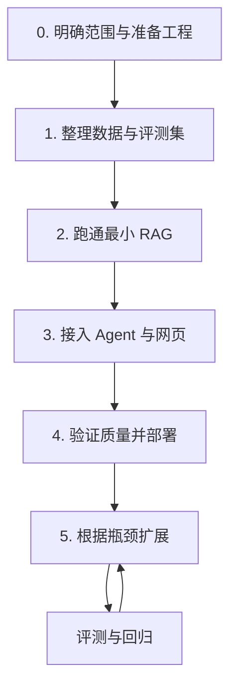

# Imm-Agent 开发任务清单

本清单将 [README 技术规划](README.md)拆解为可执行任务。README 说明项目目标与技术方案，本文件记录实施顺序、交付物和验收条件。

目前以下开发任务均未在本清单中验收，统一保持未勾选。已有网页和数据库需先盘点，再决定复用范围。建议从阶段 0 开始，每完成一项并验证结果后，将 `- [ ]` 改为 `- [x]`，并按需附上代码、文档或评测记录的位置。

## 工作流程与里程碑

| 里程碑 | 完成标志 | 对应阶段 |
| --- | --- | --- |
| M1：资料可用 | 首批资料可追溯，导入可重复，评测题有证据标注 | 0～1 |
| M2：问答可用 | 通过命令行或 API 获取带可核验引用的回答 | 2 |
| M3：网页可用 | 用户可以提问、追问、查看来源并提交反馈 | 3 |
| M4：首版可交付 | 关键检查通过，部署可复现，备份可恢复 | 4 |

阶段 5 为可选扩展，不作为首版交付的前置条件。评测、内容边界和隐私保护从前期开始实现，在阶段 4 集中验收。

## 阶段 0：明确范围与准备工程

**前置条件**：无。

- [ ] `0.1` 盘点已有网页、爬虫与 MySQL：记录代码位置、表结构、数据量、可访问方式及可复用模块。
- [ ] `0.2` 确定首版覆盖的疗法主题、用户问题类型和科普边界，列出暂不支持的功能。
- [ ] `0.3` 确定开发环境、候选模型接入方式和预算，记录外部服务的数据处理要求。
- [ ] `0.4` 建立模块目录，划分前端、后端、数据导入、评测、测试与文档职责。
- [ ] `0.5` 初始化依赖管理、锁文件、`.gitignore` 和 `.env.example`，排除密钥、数据库导出和敏感原始数据。
- [ ] `0.6` 搭建后端最小健康检查接口，以及本地 MySQL、Qdrant 的启动配置。
- [ ] `0.7` 写明代码约定、检查命令和本地启动步骤，记录模块接口及配置方式。

**交付物**：现状盘点、首版范围说明、工程骨架、环境配置示例。

**验收条件**：按说明能启动后端并连接开发数据库；首版要做什么、暂缓什么有明确记录。

## 阶段 1：整理数据与评测集

**前置条件**：阶段 0 完成；已获得现有资料的可用样本或导出文件。

### 1.1 建立数据结构

- [ ] `1.1.1` 定义文档、文档版本、片段、术语别名和索引任务的数据结构，分配稳定 ID。
- [ ] `1.1.2` 补充来源链接、发布机构、语言、发布日期、抓取日期、审核状态和内容哈希字段。
- [ ] `1.1.3` 定义“待审核、已发布、已过期、已撤回”的状态与转换规则，未知日期允许为空。
- [ ] `1.1.4` 编写数据库迁移和旧数据字段映射，在副本或开发库中验证迁移，保留原始数据备份。

**验收条件**：一条旧记录能转换为新结构，正文与原始来源信息可回溯；无法追溯的记录明确标记为待核验。

### 1.2 导入、清洗与审核

- [ ] `1.2.1` 选取首批主题资料，记录来源、使用条件和审核结果。
- [ ] `1.2.2` 实现正文提取、格式清洗、内容去重和术语别名归一，保留原始文件或快照。
- [ ] `1.2.3` 抽查清洗结果，重点检查否定词、适用条件、表格、单位及原文日期。
- [ ] `1.2.4` 实现可重复运行的导入任务，记录成功、跳过和失败条目，支持失败重试。
- [ ] `1.2.5` 实现内容变更检测及发布、撤回操作，为后续索引同步提供任务状态。
- [ ] `1.2.6` 形成首批已审核资料；暂不将待核验或已撤回内容纳入问答证据。

**验收条件**：重复导入不会产生重复文档；已发布资料均有可核验来源，失败记录可定位、可重试。

### 1.3 准备初始评测集

- [ ] `1.3.1` 整理约 50～100 个问题，覆盖概念、缩写、比较、追问、无答案和资料冲突。
- [ ] `1.3.2` 为每题标注预期证据、必要要点和不应生成的内容；可先完成少量样例以验证标注格式。
- [ ] `1.3.3` 加入个体化治疗请求、提示注入和越权访问等边界样例。
- [ ] `1.3.4` 划分开发评测集和独立测试集，记录题目及资料版本，避免反复用测试集调参。

**验收条件**：问题、参考证据和判定规则可被评测脚本读取；无答案题也有明确的预期行为。

## 阶段 2：跑通最小 RAG

**前置条件**：首批已发布资料与开发评测样例可用。

### 2.1 切分、向量化与索引

- [ ] `2.1.1` 按标题和语义切分文档，保留原文位置、标题路径、文档版本和片段 ID。
- [ ] `2.1.2` 抽查片段是否保留完整定义、否定表达和适用条件，记录初始切分参数。
- [ ] `2.1.3` 用开发评测集比较中英文 Embedding 候选模型，选定首版模型与编码配置。
- [ ] `2.1.4` 建立 Qdrant 索引，记录模型版本、向量维度及过滤字段。
- [ ] `2.1.5` 实现增量索引、幂等写入和失败重试，支持从 MySQL 与原始资料重建索引。
- [ ] `2.1.6` 验证资料更新与撤回后的查询行为，避免返回失效片段或旧版本。

**验收条件**：片段能够回溯到文档；重复建索引不会产生重复记录；已撤回内容不会被用作证据。

### 2.2 建立检索基线

- [ ] `2.2.1` 实现统一检索接口，返回片段文本、来源、文档状态、版本和检索分数。
- [ ] `2.2.2` 分别建立向量和关键词检索基线，处理中文分词、医学缩写与别名。
- [ ] `2.2.3` 使用开发评测集记录 Recall@K、排序情况和检索延迟。
- [ ] `2.2.4` 确定首版召回数量、去重方式和上下文长度，保存基线配置与失败案例。

**验收条件**：固定问题能重复运行并得到可比较的检索报告；检索不到时返回明确的空结果。

### 2.3 生成答案与校验引用

- [ ] `2.3.1` 建立模型 API 适配层，实现超时、有限重试、用量记录及错误处理。
- [ ] `2.3.2` 编写版本化提示词，明确证据使用、科普表达、资料冲突与证据不足时的行为。
- [ ] `2.3.3` 定义并校验 `answer`、`citations`、`evidence_status`、`follow_up_question` 等响应字段。
- [ ] `2.3.4` 将模型引用编号映射到本次检索的真实片段，拒绝不存在或不属于当前证据集的编号。
- [ ] `2.3.5` 建立答案与证据的支持关系检查，并人工抽查关键事实；检查失败时重新生成或返回证据不足说明。
- [ ] `2.3.6` 实现检索为空、来源冲突、模型不可用和输出格式错误时的响应。
- [ ] `2.3.7` 提供命令行或 API 演示，运行开发评测集并记录问答基线。

**验收条件**：完成“提问 → 检索 → 回答 → 查看依据”；引用均可解析，关键结论有对应证据，无答案题不会强行生成结论。

## 阶段 3：接入 Agent 与网页

**前置条件**：最小 RAG 闭环通过阶段 2 验收。

### 3.1 Agent 与多轮上下文

- [ ] `3.1.1` 实现问题分类、必要澄清、检索、证据整理、生成和校验的显式工作流。
- [ ] `3.1.2` 封装 `search_knowledge`、`get_source` 和 `lookup_term` 工具，限制参数及权限。
- [ ] `3.1.3` 为比较类问题分别检索对象，并保留各自的来源与条件。
- [ ] `3.1.4` 保存当前主题、用户确认条件和必要的历史摘要，支持指代明确的追问。
- [ ] `3.1.5` 设置工具调用次数、总耗时和重试上限，记录流程状态与请求 ID。
- [ ] `3.1.6` 验证证据不足、用户话题切换、含糊指代和工具失败时的流程。

**验收条件**：可以完成连续追问；需要澄清时发起澄清；流程在次数或时间达到上限后能正常结束。

### 3.2 API、会话与权限

- [ ] `3.2.1` 实现 `POST /api/chat`、`GET /api/sources/{id}`、`POST /api/feedback` 及参数校验。
- [ ] `3.2.2` 定义统一错误格式，前端可区分请求失败、证据不足与服务暂不可用。
- [ ] `3.2.3` 实现会话归属校验及隔离，验证不同用户或会话凭据不能访问彼此记录。
- [ ] `3.2.4` 为知识导入、发布和撤回接口增加管理员鉴权；模型工具只使用受限权限。
- [ ] `3.2.5` 实现会话保存期限、删除方式和日志脱敏，说明发送给外部模型的数据范围。

**验收条件**：正常接口可用，非法参数与越权访问被拒绝，会话删除及日志脱敏行为可验证。

### 3.3 前端交互

- [ ] `3.3.1` 建立 React + TypeScript 页面，提供提问框、会话列表和回答区域。
- [ ] `3.3.2` 增加来源卡片，显示机构、标题、日期、原文片段和来源链接。
- [ ] `3.3.3` 展示检索中、生成中、证据不足和失败状态，支持失败后重试。
- [ ] `3.3.4` 增加反馈入口，将反馈关联到回答 ID，避免重复保存不必要的敏感文本。
- [ ] `3.3.5` 完成前后端联调，验证提问、追问、展开证据与提交反馈的完整操作。

**验收条件**：用户能在网页中完成 M3 的全部操作，来源展示与当前回答一致，错误状态有可理解的说明。

## 阶段 4：验证质量并部署

**前置条件**：Agent、网页和权限控制已接通；前期评测与测试记录可用。

### 4.1 质量与边界验收

- [ ] `4.1.1` 为引用映射、文档撤回、会话隔离、工具超时和异常降级建立关键测试。
- [ ] `4.1.2` 根据已有基线确定质量、成功率、P95 延迟和单次成本的验收目标，记录测试条件。
- [ ] `4.1.3` 在固定配置下运行独立测试集，统计检索、回答、引用与性能指标。
- [ ] `4.1.4` 由具备相关知识的人员抽查医学事实、适用条件和研究状态，记录问题及处理结果。
- [ ] `4.1.5` 验证提示注入、任意 SQL 或网址调用诱导、个体化治疗请求和敏感信息处理行为。
- [ ] `4.1.6` 修复影响首版交付的问题并完成相关回归，保留已知限制和评测报告。

**验收条件**：关键测试通过，达到已记录的验收目标；发现的无依据关键结论已处理，不能仅凭引用编号合法就判定回答合格。

### 4.2 部署、日志与恢复

- [ ] `4.2.1` 完善 Docker Compose、持久化卷、健康检查和环境配置说明。
- [ ] `4.2.2` 记录请求 ID、检索耗时、模型及提示词版本、token 用量与错误类型。
- [ ] `4.2.3` 增加请求限流、模型调用预算和超时设置，验证服务异常时的行为。
- [ ] `4.2.4` 配置持续集成，运行格式检查、类型检查及关键测试。
- [ ] `4.2.5` 在干净环境中按文档启动服务，验证数据导入、问答和引用查看。
- [ ] `4.2.6` 备份业务数据与原始资料，实际演练恢复和索引重建，记录结果。
- [ ] `4.2.7` 记录应用回滚步骤及配置兼容条件，验证可回退到已知可用版本。
- [ ] `4.2.8` 整理首版使用说明、演示问题、评测报告和已知限制。

**验收条件**：新环境可以复现部署；请求失败可定位；数据可恢复；首版交付材料完整。

## 阶段 5：根据瓶颈扩展（可选）

**前置条件**：已有稳定基线及明确失败案例。只选择能解决当前问题的分支，完成实验后再决定是否纳入主流程。

| 观察到的问题 | 优先实验 | 比较方式 |
| --- | --- | --- |
| 相关资料存在但召回不足 | 切分、别名、混合检索 | 固定问题集比较 Recall@K 与耗时 |
| 相关片段已召回但排序靠后 | Reranker | 比较排序质量、答案质量及新增延迟 |
| 关系类问题需要跨实体查询 | 术语关系表、知识图谱 | 比较证据完整性与维护成本 |
| 证据充分但表达或格式持续不合格 | 提示词实验，再评估微调 | 用独立测试集比较质量与成本 |
| 工作流分支或恢复逻辑难维护 | LangGraph 等编排方案 | 验证分支、恢复和故障场景 |
| 页面等待体验不佳 | 进度事件与流式交互 | 验证等待体验及校验后内容发布 |

### 5.1 混合检索与重排

- [ ] `5.1.1` 对比关键词、向量及融合检索，记录不同问题类型的收益。
- [ ] `5.1.2` 加入候选 Reranker，比较候选数量、排序效果、成本与延迟。
- [ ] `5.1.3` 仅在预先设定的指标上有收益且关键行为未退步时采用新配置，保留旧配置用于回退。

### 5.2 知识图谱

- [ ] `5.2.1` 定义实体与关系结构，建设附带来源、日期和限定条件的小规模样例。
- [ ] `5.2.2` 核验实体与关系抽取结果，先用 MySQL 关系表验证查询需求。
- [ ] `5.2.3` 比较图谱辅助检索与原有 RAG，确认多跳需求后再评估 Neo4j。

### 5.3 模型微调

- [ ] `5.3.1` 证明主要问题来自模型行为，而非资料缺失或检索失败，明确微调目标。
- [ ] `5.3.2` 准备经审核、脱敏且使用权限明确的样本，按文档或主题划分训练、验证和测试集。
- [ ] `5.3.3` 评估训练模型、LoRA 配置和资源预算，保存训练配置及数据版本。
- [ ] `5.3.4` 与未微调基线比较质量、证据遵循及成本，继续保留 RAG 获取资料。

### 5.4 工作流与交互优化

- [ ] `5.4.1` 在分支和恢复需求明确后，评估图式编排并验证执行状态恢复。
- [ ] `5.4.2` 增加流式进度事件，在内容与引用通过校验后发布最终答案。
- [ ] `5.4.3` 根据实测性能评估缓存或异步任务，验证资料更新、撤回时缓存失效。

**本阶段验收条件**：每项采用的扩展均有基线对比、回归结果和回退方法；未选用的任务保持未勾选并注明暂缓原因。

## 每次开发的固定流程

1. 从当前阶段选择一个任务，明确输入、输出和验收示例。
2. 检查前置条件，按小范围实现；使用 AI 编程工具时一并提供接口和约束。
3. 审查生成或修改的代码，重点检查数据权限、异常处理和依赖调用。
4. 运行与改动相关的检查；修改检索、模型或提示词时执行对应评测。
5. 记录产物与验证结果，验收通过后勾选任务，再保存为范围清晰的 Git 提交。

任务阻塞时，在对应条目下记录缺少的数据、配置或决策及解除条件，不将未验收任务标记完成。

## 当前起步顺序

先完成 `0.1` 现状盘点，接着确定 `0.2` 首版范围，再落实 `0.3` 开发环境与模型预算。工程准备好后，从少量可追溯资料和评测样例跑通导入流程，再扩充数据规模。
