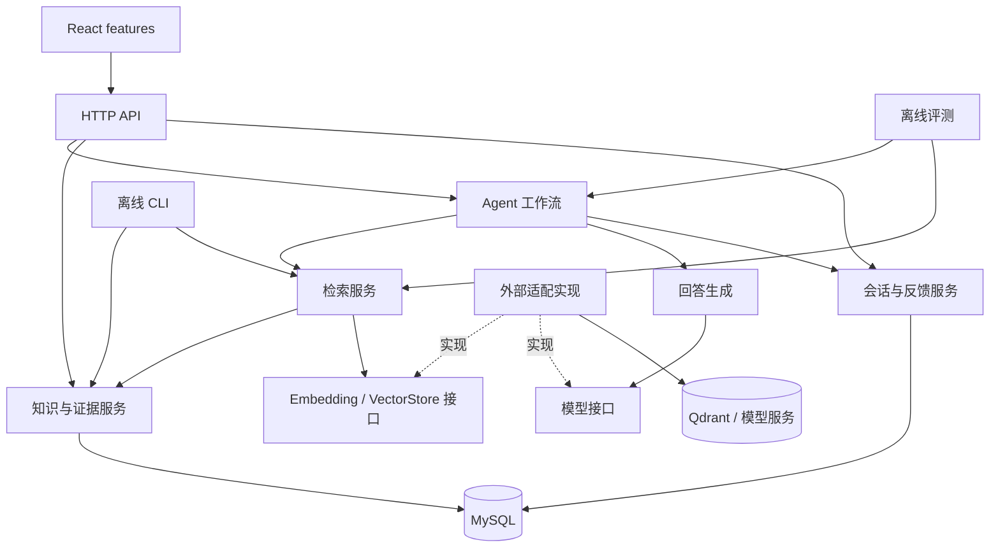

# Imm-Agent 架构导航

本项目采用模块化单体：一个 FastAPI 应用、一个 React 前端、独立运行的离线 CLI，MySQL 保存权威数据，Qdrant 保存可重建索引。按业务能力组织代码，先用明确接口隔离变化，不提前拆成微服务。

**当前运行状态：** 第一、二阶段已实现；现有后端逻辑仍在 `app/main.py`、`knowledge.py`、`evaluation.py` 等入口，前端仍由 `App.tsx` 组织。新模块中的 `PLANNED` 文件只是设计占位，不注册路由、不建立连接、不返回模拟成功。目录齐全不代表 RAG、会话或反馈已经实现。

## 阅读顺序

1. [根任务导航](../../TODO.md)：选择阶段和任务。
2. [目录职责](directory-map.md)：判断文件应该放在哪里。
3. [依赖与接口边界](boundaries.md)：确定谁能调用谁、谁拥有数据。
4. [现有代码迁移表](migration.md)：了解当前入口和目标位置。
5. 模块旁的 `TODO.md`：查看文件用途和实现顺序。
6. [数据与跨设备开发](data-lifecycle.md)：区分 Git 内容、资料和备份。

## 目标目录概览

`现有` 表示有运行实现；`占位` 表示未来落点。完整逐文件清单见 [layout.json](layout.json)，其中只登记核心入口和占位，不替代源码索引。

```text
imm-Agent/
├── README.md                     项目介绍与导航
├── TODO.md                       阶段与模块入口，不重复维护卡片状态
├── REVIEW.md                     已实际执行的变更与验收记录
├── compose.yaml                  现有开发环境
├── .env.example                  可提交的配置模板
├── .github/workflows/            CI 示例占位，未启用
├── backend/
│   ├── app/
│   │   ├── main.py               现有 FastAPI 入口；未来仅装配依赖与路由
│   │   ├── knowledge.py ...      现有逻辑；按 ARCH-02 逐步迁入 modules
│   │   ├── api/                  占位：HTTP 路由、请求校验、依赖与错误
│   │   ├── core/                 占位：配置、共用错误、安全日志
│   │   ├── infrastructure/       占位：SQL、Qdrant、Embedding、模型适配
│   │   ├── modules/
│   │   │   ├── knowledge/        占位：资料采集、版本、发布、证据核验
│   │   │   ├── retrieval/        占位：切分、索引、检索
│   │   │   ├── answering/        占位：生成、引用校验、版本化 prompts
│   │   │   ├── agent/            占位：分类、安全分流、显式工作流
│   │   │   ├── conversations/    占位：会话身份、消息与必要上下文
│   │   │   ├── feedback/         占位：回答反馈与归属校验
│   │   │   └── evaluation/       占位：题集、指标、基线和版本报告
│   │   └── cli/                 现有导入/发布 CLI；索引/评测/备份占位
│   ├── migrations/              现有表结构历史，目录移动不改旧迁移
│   └── tests/                   现有测试；modules/integration 新增计划
├── frontend/
│   ├── src/
│   │   ├── App.tsx               现有页面；未来组装 features
│   │   ├── features/             占位：chat、sources、conversations、feedback
│   │   └── shared/               占位：api 客户端与少量通用 UI
│   └── tests/                   交互测试计划
├── evals/                       现有 questions.jsonl；评测资产说明
├── data/                        公开来源元数据、非医学样例和数据说明
│   ├── raw/                     本地原始资料；Git 忽略
│   └── backups/                 未来备份输出；Git 忽略，按需创建
├── artifacts/                   运行报告/检索基线；Git 忽略，按需创建
├── logs/                        运行日志；Git 忽略，按需创建
├── deploy/                      生产部署占位及运维 TODO
├── scripts/                     架构检查；不重复实现业务 CLI
├── tests/e2e/                   跨服务端到端验收计划
└── docs/
    ├── architecture/            本架构及机器可读目录清单
    ├── tasks/                   原 01—42 验收卡和 ARCH 迁移卡
    └── *.md                     范围、来源、工作流和发布报告模板
```

## 目标调用关系



实线表示调用，虚线表示接口实现。`main.py` / `api/dependencies.py` 和 CLI 负责把具体适配实现注入服务。图为目标结构，当前已运行链路以迁移表为准。

## 当前设计约束

- 业务边界以 [mvp-scope.md](../mvp-scope.md) 为准；紧急引导、拒绝、澄清等分支先于检索和知识生成。
- 先明确需求中的接口再实现，不预建通用 Repository 框架、插件注册中心或事件总线。
- 未完成的模块不导入 `main.py`；Python 占位仅含说明，TypeScript 占位仅导出空模块；未来 CLI 执行时明确非零退出。
- 一张任务卡包含所有跨模块改动及验收，不把“文件存在”当成任务完成。
- 架构迁移不改变来源 ID、正文哈希、数据库表或现有命令；先通过原有回归再移除旧入口。
- 知识图谱、微调、Reranker、流式输出等只在任务总入口的后续实验清单中保留，未创建首版运行目录。
