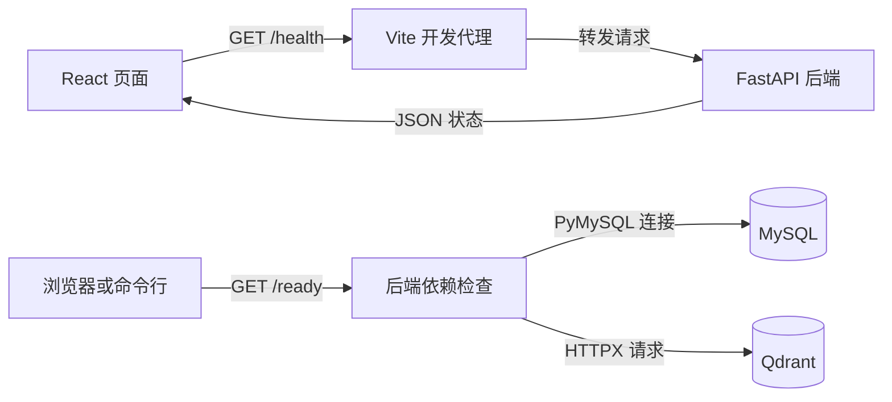

# Imm-Agent 技术栈入门导读

本文帮助初次接触项目的读者理解各项技术的职责、选型理由和代码入口。每个技术点只给出必要解释，方便按关键词自行深入搜索；环境安装细节见 [开发工作流](development-workflow.md)，开发任务见 [TODO.md](../TODO.md)。

## 1. 先看系统如何组成

Imm-Agent 的目标是让用户提出科普问题，系统查找可靠资料，再组织带来源的回答。可以按四层理解：React 页面负责交互，FastAPI 后端处理请求，MySQL 与 Qdrant 保存资料和检索索引，Agent 与大模型组织问答过程。

截至 2026-10-01，代码已包含页面草稿交互、后端健康检查和四服务开发环境；问答流程属于项目设计，发送按钮仍禁用。下文用“代码中”“设计中”“可选”标明用法，不逐项列开发待办。

下面是代码中可以跟踪的一次请求：



`/health` 回答“后端进程能否响应”，`/ready` 回答“MySQL 和 Qdrant 能否连接”。这两个结果只反映基础服务状态。

## 2. 前端：把操作变成页面状态

### React 与 React DOM

- **是什么**：React 用组件描述界面；React DOM 把组件渲染到浏览器页面。
- **为什么**：提问模式、草稿和弹窗需要随用户操作更新，用状态驱动界面便于保持一致。
- **在本项目里怎么用**：代码中，[main.tsx](../frontend/src/main.tsx) 挂载应用，[App.tsx](../frontend/src/App.tsx) 管理工作台。`useState` 保存草稿和模式，`useEffect` 发起健康检查，`useRef` 引用输入框以便聚焦。点击推荐问题后，草稿状态更新，输入框随之显示新内容。

### TypeScript

- **是什么**：在 JavaScript 上增加类型检查的语言，帮助开发时发现数据使用错误。
- **为什么**：模式、服务状态和组件参数有固定取值，类型约束可以减少拼写和传参错误。
- **在本项目里怎么用**：代码中，`App.tsx` 定义 `Mode`、`ServiceStatus` 等类型；`npm run build` 先执行 `tsc -b` 检查类型，再构建页面。类型检查不替代对网络响应的运行时检查。

### Node.js、npm 与 Vite

- **是什么**：Node.js 是 JavaScript 运行环境；npm 管理依赖和命令；Vite 提供开发服务器与前端构建工具。
- **为什么**：把依赖安装、页面开发、代码打包放进统一工具链，便于重复运行。
- **在本项目里怎么用**：代码中，[前端 Dockerfile](../frontend/Dockerfile) 使用 `node:22`，通过 `npm ci` 按锁文件安装依赖；[package.json](../frontend/package.json) 定义开发、构建和检查命令。[vite.config.ts](../frontend/vite.config.ts) 在 5173 端口提供页面，并将 `/health` 转发到 `backend:8000`。页面代码在浏览器中运行，Node.js 运行开发工具。

### Material UI、Emotion 与 CSS

- **是什么**：Material UI 提供按钮、输入框和弹窗等组件；Emotion 支持组件样式；CSS 控制布局与外观。
- **为什么**：通用控件使用现成组件，项目特有的双栏布局和窄屏适配用 CSS 表达。
- **在本项目里怎么用**：代码中，`main.tsx` 用 `ThemeProvider` 统一颜色、字体和圆角；[App.css](../frontend/src/App.css) 用 Flex 分配纵向空间、Grid 排列主内容，并通过媒体查询适配屏幕宽度；[index.css](../frontend/src/index.css) 提供全局基础样式。

## 3. 后端与数据：接收请求、校验结构、保存信息

### Python、FastAPI 与 Uvicorn

- **是什么**：Python 是后端使用的语言；FastAPI 定义 HTTP 接口；Uvicorn 运行应用并接收网络请求。
- **为什么**：Python 便于连接数据处理与模型工具，FastAPI 可以把这些能力组织成前端可调用的接口。
- **在本项目里怎么用**：代码中，[main.py](../backend/app/main.py) 定义 `GET /health` 和 `GET /ready`，[后端 Dockerfile](../backend/Dockerfile) 启动 Uvicorn。开发环境可打开 `http://127.0.0.1:8000/docs` 查看接口并发送请求。

### Pydantic 与 pydantic-settings

- **是什么**：Pydantic 按声明的类型校验数据；pydantic-settings 用相同方式读取和校验配置。
- **为什么**：接口输出和数据库连接参数需要明确格式，错误配置应尽早被发现。
- **在本项目里怎么用**：代码中，`HealthResponse`、`ReadinessResponse` 定义响应结构；[settings.py](../backend/app/settings.py) 读取 `IMM_AGENT_*` 环境变量，例如限制数据库端口的取值范围。结构正确并不等于内容事实正确。

### MySQL 与 Qdrant

- **是什么**：MySQL 是按表保存结构化数据的关系数据库；Qdrant 是存储向量并进行相似性检索的数据库。
- **为什么**：来源、版本和发布状态需要明确记录，按语义查找资料则需要相似性检索，两种存储各有职责。
- **在本项目里怎么用**：代码中，[compose.yaml](../compose.yaml) 启动两个服务并配置数据卷。设计中，MySQL 保存正文、来源和状态等权威记录，Qdrant 保存向量与片段 ID，作为可以从原始资料重建的索引。例如先检索到片段 ID，再核对它对应文档的版本和发布状态。

### PyMySQL 与 HTTPX

- **是什么**：PyMySQL 是 Python 连接 MySQL 的驱动；HTTPX 是发送 HTTP 请求的客户端库。
- **为什么**：后端需要分别通过数据库协议和 HTTP 检查两个依赖服务。
- **在本项目里怎么用**：代码中，[readiness.py](../backend/app/readiness.py) 用 PyMySQL 建立短连接，用 HTTPX 请求 Qdrant 的 `/readyz`，将结果交给 `/ready` 接口。

### SQLAlchemy 与 Alembic（设计中）

- **是什么**：SQLAlchemy 提供数据库访问和对象关系映射能力；Alembic 管理表结构的版本迁移。
- **为什么**：随着业务表变化，需要让代码中的数据模型和不同环境的数据库结构保持一致。
- **在本项目里怎么用**：项目设计用 SQLAlchemy 表达文档、片段等业务记录，用 Alembic 记录建表、增列等变更。理解时可把“操作表里的数据”和“修改表的结构”分开；当前依赖检查直接使用 PyMySQL。

## 4. 问答核心：让回答有依据

本节说明 [README](../README.md) 中的设计。以“某个术语是什么意思”为例，资料先经过清洗、审核、切分和索引；用户提问时，系统检索相关片段，把证据交给模型组织答案，再校验引用。

### 数据采集与知识治理

- **是什么**：采集把外部资料带入系统；知识治理管理资料的来源、质量、版本和可用状态。
- **为什么**：检索和生成依赖输入资料的质量，保存出处与状态才能解释答案从哪里来。
- **在本项目里怎么用**：设计中，用 Python 导入公开资料，保留来源链接、机构、日期和内容哈希；只有审核发布的资料可以成为证据。内容哈希用于识别内容是否重复或发生变化。

### RAG

- **是什么**：Retrieval-Augmented Generation，检索增强生成，即先找资料，再让模型依据资料回答。
- **为什么**：让回答关联可检查的外部证据，资料更新时可以更新知识库。
- **在本项目里怎么用**：设计中，将文档切成保留原文位置的片段，检索相关内容后传给模型，并把回答中的引用编号映射回真实来源。RAG 提供证据通路，引用是否支持结论仍要核验。

### Embedding、关键词检索与 Reranker

- **是什么**：Embedding 将文本编码成数值向量，用于比较语义相似性；关键词检索查找词语匹配；Reranker 对检索候选重新打分排序。
- **为什么**：口语表达需要语义匹配，术语和缩写需要精确匹配，候选排序会影响模型读到哪些证据。
- **在本项目里怎么用**：设计中，文档与问题使用匹配的向量编码方式，由 Qdrant 查找相近片段；关键词检索作为另一条基线，Reranker 属于可选组件。例如用户表述与原文措辞不同，向量检索仍可能找到相关内容。相似度不等于事实可信度。

### 大模型与提示词工程

- **是什么**：大模型根据输入生成文本；提示词说明任务、可用证据、输出格式和约束。
- **为什么**：检索返回的是资料片段，需要把它们组织成易读、带引用的回答。
- **在本项目里怎么用**：设计中，通过统一的模型 API 适配层调用模型；提示词要求依据提供的证据回答，输出答案、引用和证据状态。适配层集中处理调用细节，便于替换模型；Pydantic 可检查输出字段结构。

### AI Agent 与 LangGraph

- **是什么**：这里的 Agent 是围绕任务组织判断、工具调用和回答步骤的程序；LangGraph 是用状态图表达执行流程的框架。
- **为什么**：普通解释、含糊提问和对象比较需要不同的处理步骤，单次模型调用不足以表达全部控制逻辑。
- **在本项目里怎么用**：设计中，先用 Python 函数和状态对象串起“分类 → 必要时澄清 → 检索 → 生成 → 校验”，比较问题分别检索两个对象。LangGraph 是复杂流程的可选工具，简单流程可以直接阅读 Python 调用关系。

### 知识图谱与 Neo4j（可选）

- **是什么**：知识图谱用实体和关系描述知识；Neo4j 是存储、查询图结构的数据库。
- **为什么**：当问题关注多个对象之间的关系时，显式关系比单纯的文本相似性更容易查询。
- **在本项目里怎么用**：设计中，先用 MySQL 术语、别名和关系表表达对象联系，每条关系保留证据出处；Neo4j 用于评估复杂关系查询的价值。理解基础问答流程时，先掌握术语归一和来源关联即可。

### 模型微调与 LoRA（可选）

- **是什么**：微调用任务样本继续训练模型；LoRA 通过训练少量附加参数降低可训练参数量。
- **为什么**：当任务表现存在稳定短板时，训练样本可以帮助模型学习特定的表达方式或输出行为。
- **在本项目里怎么用**：设计中，微调用于研究解释风格、分类或固定输出行为的改进，知识证据仍由 RAG 提供。它属于独立实验方向，阅读当前页面和后端代码无需先学习训练模型。

## 5. 工程基础：运行、检查与协作

### pytest、Oxlint 与 Ragas

- **是什么**：pytest 运行 Python 测试；Oxlint 静态检查前端代码；Ragas 提供 RAG 效果评估工具。
- **为什么**：程序行为、代码问题和回答质量是不同的检查对象，需要分别验证。
- **在本项目里怎么用**：代码中，[后端测试](../backend/tests/test_readiness.py) 用替代的依赖检查结果验证就绪接口，前端用 `npm run lint` 执行 Oxlint。设计中的固定问题集用于比较检索与回答效果，Ragas 是可选辅助工具。通过构建和接口测试不能直接证明回答质量。

### 内容安全与隐私保护

- **是什么**：约束系统如何使用输入、输出内容、访问数据和保存用户信息。
- **为什么**：项目需要保持科普范围，并避免跨会话访问或不必要的信息保存。
- **在本项目里怎么用**：代码中，页面说明科普定位并将草稿限制为 500 字符；设计中，在后端落实证据校验、会话隔离和日志脱敏。前端输入限制是交互约束，后端负责可信的数据校验边界，具体范围见 [MVP 范围](mvp-scope.md)。

### Docker Compose、配置与数据卷

- **是什么**：镜像是运行环境模板，容器是运行实例；Compose 用一个文件组织多个服务；数据卷独立保存持久化数据。
- **为什么**：让前端、后端和数据库用一致的配置启动，减少本机依赖差异。
- **在本项目里怎么用**：代码中，`compose.yaml` 管理 frontend、backend、mysql、qdrant 四个服务；MySQL 与 Qdrant 分别使用命名卷；`.env` 提供本地配置。浏览器通过本机端口访问服务，容器之间使用 `backend`、`mysql` 等服务名通信。

### 可观测性与 CI

- **是什么**：可观测性帮助从状态、日志和指标理解运行情况；CI（持续集成）在提交代码时自动运行检查。
- **为什么**：系统出错时需要定位原因，多人或多次修改时需要重复执行同一组检查。
- **在本项目里怎么用**：代码中，健康检查和 `/ready` 提供基础状态信息；设计中，用请求 ID 关联检索和模型调用日志，CI 执行构建与测试。现有手工检查命令见下方学习路径。

### VibeCoding 与 Git

- **是什么**：这里的 VibeCoding 指用自然语言与 AI 编程助手协作；Git 记录文件版本和差异。
- **为什么**：任务边界、差异审查和可运行检查，能让生成的改动便于理解与验证。
- **在本项目里怎么用**：按 `TODO.md` 选择任务，查看 `git diff`，运行相关检查，再向 [REVIEW.md](../REVIEW.md) 追加变更和验证记录。先理解改动解决什么问题，再决定是否接受。

### 系统设计

- **是什么**：划分模块职责，约定数据流向，以及失败时的处理方式。
- **为什么**：页面、资料管理、检索和模型调用的变化速度与失败原因不同，明确边界可以降低相互影响。
- **在本项目里怎么用**：代码中，前后端与数据服务分别运行，存活检查与依赖检查分开；设计中，资料导入和索引构建独立于在线问答，MySQL 保存权威记录，Qdrant 索引可重建。阅读时重点追踪“谁负责这份数据、下一步交给谁”。

## 6. 术语速查

| 术语 / 搜索关键词 | 一句话解释 | 在项目里对应什么 |
| --- | --- | --- |
| 组件 / Component | 可组合的界面单元 | 输入框、按钮、工作台 |
| 状态 / State | 会影响界面或流程的数据 | 当前模式、草稿、服务状态 |
| API / HTTP / JSON | 调用约定 / 网络请求协议 / 数据格式 | 页面请求 `/health` 并读取状态 |
| 代理 / Proxy | 代为转发请求 | Vite 把健康请求转给后端 |
| Schema | 对数据字段与类型的约定 | Pydantic 响应模型 |
| ORM / Migration | 对象与数据库的映射 / 表结构版本变更 | SQLAlchemy / Alembic |
| LLM / Prompt | 大语言模型 / 给模型的任务说明 | 基于证据组织回答 |
| Token | 模型处理文本的计量单位，不等同于字数 | 上下文长度与用量统计 |
| Chunk / Metadata | 文档片段 / 描述资料的附加字段 | 正文片段、来源、日期、版本 |
| Embedding / 向量 | 文本编码过程 / 编码后的数值序列 | 支持按语义查找片段 |
| 索引 / Index | 用于加快查询的数据结构 | Qdrant 中的检索数据 |
| 召回 / Top K | 找出候选 / 取排序靠前的 K 项 | 选出交给模型的资料 |
| Reranker | 给已找到的候选重新排序的模型 | 可选检索排序环节 |
| RAG / Agent | 检索后生成 / 组织任务执行步骤 | 证据问答 / 问答流程控制 |
| 引用 / Citation | 回答与来源之间的关联 | 引用编号映射到原文片段 |
| 幂等 / Idempotency | 重复执行不产生额外的重复结果 | 重复导入同一资料时去重 |
| 健康检查 / 就绪检查 | 进程是否响应 / 所需依赖是否可用 | `/health` / `/ready` |
| 镜像 / 容器 / 卷 | 环境模板 / 运行实例 / 持久化存储 | Docker 开发环境 |
| Mock / 测试替身 | 用可控行为代替真实依赖 | 模拟数据库可用或不可用 |
| CI / 回归测试 | 自动集成检查 / 验证改动未破坏已有行为 | 重复执行构建和测试 |

## 7. 学习路径：先跑通，再沿代码阅读

这是一条阅读和练习顺序。每一步掌握最小概念即可继续，遇到不熟悉的词再用上面的关键词搜索。

| 顺序 | 学习重点 | 阅读入口与小练习 | 学到什么算够用 |
| --- | --- | --- | --- |
| 1 | 容器、端口、环境变量 | 按 [开发工作流](development-workflow.md) 准备环境，运行下方启动命令 | 能打开页面，知道四个服务各做什么 |
| 2 | HTML/CSS、JavaScript 基础、React 状态、TypeScript 类型 | 从 `main.tsx` 进入 `App.tsx`，点击推荐问题并追踪草稿更新 | 能解释文字如何从点击事件进入输入框 |
| 3 | Python 基础、HTTP、JSON、FastAPI、Pydantic | 从 `vite.config.ts` 的代理跟到 `main.py` 的 `/health` | 能说清请求路径和响应字段 |
| 4 | 关系数据、向量索引、健康检查 | 阅读 `compose.yaml`、`settings.py` 和 `readiness.py` | 能区分 MySQL 与 Qdrant、`/health` 与 `/ready` |
| 5 | 资料切分、Embedding、RAG、Agent | 对照第 4 节，用一段示例资料手画“问题 → 片段 → 回答 → 引用” | 能说明检索、生成和流程控制各负责什么 |
| 6 | 测试替身、静态检查、Git 差异 | 阅读后端测试，执行下方检查命令 | 能解释这些检查证明了什么 |

在项目根目录操作。首次运行先按开发工作流创建 `.env` 并设置本地数据库密码；已有配置直接保留。Python、Node.js 和项目依赖由容器提供。

```text
docker compose config --quiet
docker compose up -d --build
docker compose ps
```

四个服务就绪后，打开 `http://127.0.0.1:5173` 体验草稿交互，打开 `http://127.0.0.1:8000/docs` 尝试健康与就绪接口。在 PowerShell 中也可以直接查看响应：

```powershell
Invoke-RestMethod http://127.0.0.1:5173/health
Invoke-RestMethod http://127.0.0.1:8000/ready
```

前者经过 Vite 代理，预期返回 `status: ok`；后者直接访问后端，两个依赖可连接时返回 `status: ready`。

容器运行后执行以下检查，用于练习项目的验证流程：

```text
docker compose exec -T frontend npm run build
docker compose exec -T frontend npm run lint
docker compose exec -T backend python -m pytest
```

预期分别为构建成功、静态检查通过和测试通过。这些是读者可执行的操作，不是本文修改时重新运行的验收结果。具体依赖版本以 [前端依赖声明](../frontend/package.json)、[前端锁文件](../frontend/package-lock.json)、[后端依赖声明](../backend/pyproject.toml) 和 `compose.yaml` 为准。
