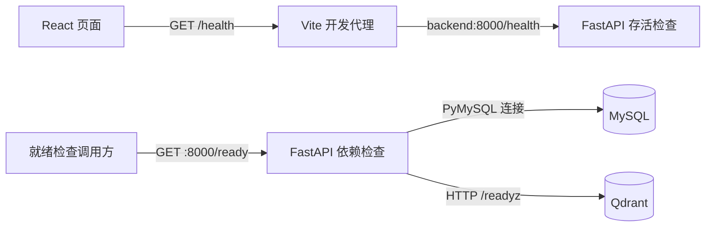

# Imm-Agent 技术栈与阶段实现总结

记录日期：2026-10-01（Asia/Shanghai）。本文依据 [README 技术规划](../README.md)、[开发任务清单](../TODO.md) 和当前仓库代码整理，作为前端页面阶段的实现快照。

## 1. 当前阶段

项目已具备 React 前端工作台、FastAPI 服务骨架、MySQL 与 Qdrant 容器配置，以及基础健康检查。前端可以选择提问方式、编辑草稿、组合比较问题和查看说明。

当前尚未形成真实问答闭环：发送按钮禁用，页面不生成回答，没有真实引用和历史会话；知识导入、检索、模型调用及聊天 API 仍待实现。页面上的处理流程与证据状态是功能说明，不能作为 RAG 或 Agent 已完成的依据。

## 2. 对照 README 的技术栈

| 技术方向 | 项目中的职责与选型 | 当前实现 | 后续工作 |
| --- | --- | --- | --- |
| AI Agent | 先用 Python 显式流程组织分类、澄清、检索、生成与校验；复杂后再评估 LangGraph | 尚无工作流代码 | 在检索与模型接口可用后接入流程和有限重试 |
| RAG | 将已审核资料转成可检索片段，为回答提供证据 | 只有页面中的流程说明与来源空状态 | 实现切分、索引、检索、生成和引用校验 |
| 数据采集与知识治理 | Python 导入、正文清洗、去重、版本与发布状态管理 | 资料规则已写入规划，尚无导入程序 | 实现清单导入及发布、过期、撤回流程 |
| Embedding 与检索排序 | 建立中英文向量与关键词检索基线，按评测引入融合和 Reranker | Qdrant 服务已配置，尚无向量化与检索代码 | 封装 Embedding 接口，建立索引与召回评测 |
| 大模型与提示词工程 | 可替换的模型 API 适配层、版本化提示词、结构化输出 | 尚未接入模型或提示词模板 | 实现 Provider、响应结构及证据约束 |
| 数据库 | MySQL 保存权威记录，Qdrant 保存可重建索引 | 已配置服务、持久化卷及依赖检查；MySQL 检查使用 PyMySQL | 引入 SQLAlchemy、Alembic，建立业务表及索引同步任务 |
| 知识图谱 | 先做术语与关系表，有需要再评估 Neo4j | 未实现，属于后续扩展 | 根据关系类查询需求和评测决定是否引入 |
| 模型微调 | 用高质量样本改善稳定的任务短板，后续评估 LoRA | 未实现，首版不以微调为前提 | 基础 RAG 评测后再判断必要性 |
| 前后端 | React + TypeScript；FastAPI + Pydantic | 页面、局部状态、健康检查接口与配置校验已实现 | 接入聊天、来源、会话与反馈 |
| 评估与测试 | pytest、固定问题集、人工评审；按需使用 Ragas | 已有 3 个后端接口测试；前端可执行 build 和 Oxlint | 增加检索评测、回答评测及前端交互测试 |
| 内容安全与隐私保护 | 科普范围、证据检查、权限隔离、输入约束和日志脱敏 | 已有范围文档、页面能力说明与 500 字符输入限制 | 将边界落实到后端校验、引用核验、会话隔离和日志策略 |
| 部署与可观测性 | Docker Compose、健康检查、结构化日志和 CI | 四服务开发环境、健康检查与开发工作流已具备 | 问答日志、CI、生产部署及备份恢复演练 |
| VibeCoding | 小步修改、代码审查、自动检查 | 已有任务卡、构建检查和追加式 REVIEW 记录 | 持续按验收条件推进并记录验证结果 |
| 系统设计能力 | 模块边界、状态与版本一致性、容错及成本控制 | 已划分前后端与数据服务，区分存活检查与依赖就绪检查 | 随知识库和问答实现细化模块、版本和失败处理 |

## 3. 前端实现

### 3.1 技术组成

以下是 [package.json](../frontend/package.json) 中的声明范围，精确依赖解析见 [package-lock.json](../frontend/package-lock.json)，不表示各组件的最新版本。

| 组件 | 声明范围或镜像 | 当前用途 |
| --- | --- | --- |
| React / React DOM | `^19.2.8` | 渲染工作台及管理交互状态 |
| TypeScript | `~6.0.2` | 约束模式、服务状态、组件与工具配置的类型 |
| Vite / React 插件 | `^8.3.0` / `^6.1.1` | 开发服务、构建及 `/health` 代理 |
| Material UI / 图标库 | `^9.4.0` | 按钮、输入框、弹窗、提示、卡片和图标 |
| Emotion React / Styled | `^11.14.0` / `^11.14.1` | Material UI 样式依赖 |
| Oxlint | `^1.81.0` | 静态代码检查 |
| Node.js | `node:22` | 在容器中安装依赖、开发和构建 |

当前用 `useState` 管理页面状态，`useEffect` 执行健康检查，`useRef` 聚焦输入框；没有引入路由或全局状态管理库。

### 3.2 页面与交互

| 区域 | 已实现行为 | 当前边界 |
| --- | --- | --- |
| 左侧导航 | 切换科普问答、疗法比较、研究进展；展示当前草稿摘要 | 模式只影响前端引导内容，没有对应后端业务分支 |
| 新建会话 | 清空草稿，恢复默认模式、比较对象与维度 | 只重置本地状态，不创建服务端会话 |
| 推荐问题 | 按模式展示问题，点击后填入并聚焦输入框 | 不自动提交或检索 |
| 疗法比较 | 选择两个对象与比较维度，整理成问题；相同对象时提示并禁用整理按钮 | 尚不生成比较结果 |
| 底部输入区 | 受控草稿、字符计数、最多 500 字符；默认一行，最多展开四行 | 发送禁用；草稿仅在当前页面内存中，刷新后清除 |
| 资料来源区 | 空状态、来源字段说明弹窗、三种证据状态图例 | 没有真实来源卡片、引用展开或证据判断 |
| 服务状态 | 展示检查中、正常、未连接；支持手动重查和离线提示 | 只检查 `/health`，不检查问答是否可用 |
| 使用指南 | 说明草稿操作、计划能力及科普边界 | 说明文字不能替代后端安全约束 |

### 3.3 布局与样式

[main.tsx](../frontend/src/main.tsx) 使用 `ThemeProvider`、`createTheme` 和 `CssBaseline` 设置浅色主题、字体、主色与圆角。[App.css](../frontend/src/App.css) 负责工作台布局和页面样式，[index.css](../frontend/src/index.css) 提供全局基础样式。

工作台以 `100dvh` 限定高度，通过 Flex 分配顶部栏、内容区和底部输入区。内容区独立滚动，输入区留在底部；`min-width: 0` 和草稿摘要省略规则限制长文本撑宽侧栏。主内容采用 Grid，在宽屏排列问题区和证据区，并拉伸两列使末尾卡片底边对齐。

CSS 设置了 1180、850、650 和 380 px 断点，逐步调整主内容列数、导航布局、推荐卡片与间距。页面还包含跳到主要内容链接、控件标签、模式选中状态和服务状态播报。本次只核对相关代码，未据此宣称已经完成所有视口或无障碍验收。

### 3.4 前后端连接

页面挂载或用户手动重查时请求 `/health`，通过 `AbortController` 设置 6 秒超时，并在清理时取消请求。只有 HTTP 成功且响应满足 `status: "ok"`、`service: "imm-agent"` 才显示服务正常；请求失败、超时或内容不匹配均显示未连接。

[vite.config.ts](../frontend/vite.config.ts) 当前仅将 `/health` 代理到 `http://backend:8000`。后续接入聊天时还需要配置 `/api` 代理。页面没有定时轮询，后端启停后需手动重查或刷新页面更新状态。

## 4. 后端、数据服务与运行环境

[backend/app/main.py](../backend/app/main.py) 使用 FastAPI 定义接口，Pydantic 定义响应模型；[settings.py](../backend/app/settings.py) 使用 `pydantic-settings` 读取并校验 `IMM_AGENT_*` 配置。

| 接口 | 当前行为 | 可证明的范围 |
| --- | --- | --- |
| `GET /health` | 返回 `{"status":"ok","service":"imm-agent"}` | API 进程可响应，不检查数据库或模型 |
| `GET /ready` | 检查 MySQL 与 Qdrant；全部可用返回 200，否则返回 503 和逐项状态 | 两个数据依赖可连接，不检查业务表、索引内容或问答能力 |

[readiness.py](../backend/app/readiness.py) 通过 PyMySQL 建立短连接检查 MySQL，通过 HTTPX 访问 `/readyz` 检查 Qdrant。仓库尚无 SQLAlchemy 模型、Alembic 迁移、资料导入、检索或模型调用模块。

[compose.yaml](../compose.yaml) 管理以下开发服务，端口绑定到宿主机 `127.0.0.1`：

| 服务 | 镜像与入口 | 宿主机访问 | 持久化或代码挂载 |
| --- | --- | --- | --- |
| frontend | `node:22`，`npm run dev` | `5173` | 挂载 `frontend/`，容器内独立 `node_modules` 卷 |
| backend | `python:3.10.11-slim`，Uvicorn | `8000` | 代码通过 Dockerfile 复制进镜像 |
| mysql | `mysql:8.4` | 默认 `3306`，可由环境变量调整 | `mysql_data` 命名卷 |
| qdrant | `qdrant/qdrant:v1.15.5` | `6333`、`6334` | `qdrant_data` 命名卷 |

前端等待后端健康，后端等待两个数据服务健康。前端依赖通过 `npm ci` 按锁文件安装；后端依赖目前在 `pyproject.toml` 中以版本范围声明，未提供对应锁文件。当前前端容器运行 Vite 开发服务器，生产静态资源托管尚未配置。完整环境安装与启动步骤见 [开发工作流](development-workflow.md)。

## 5. 本次验证与限制

2026-10-01 在现有运行容器中执行以下命令。命令均从项目根目录运行；`exec` 命令要求相应容器已启动。

| 检查命令 | 本次结果 |
| --- | --- |
| `docker compose config --quiet` | 通过 |
| `docker compose exec -T frontend npm run build` | TypeScript 与 Vite 构建通过 |
| `docker compose exec -T frontend npm run lint` | 0 warnings、0 errors |
| `docker compose exec -T backend python -m pytest` | 3 passed、1 条依赖弃用警告 |
| `docker compose ps --format json` | frontend、backend、mysql、qdrant 均为 healthy |
| `(Invoke-WebRequest -UseBasicParsing http://127.0.0.1:5173/health).Content`（PowerShell） | 返回 `status: ok`、`service: imm-agent` |
| `(Invoke-WebRequest -UseBasicParsing http://127.0.0.1:8000/ready).Content`（PowerShell） | 返回 `status: ready`，两个依赖均为 `ok` |

后端测试覆盖健康接口、依赖全部可用和 MySQL 不可用时的就绪响应，依赖状态使用替身。它们不覆盖实际检索、模型行为或多轮会话。弃用警告来自 Starlette TestClient 对 HTTPX 的使用，本次仅记录，未调整依赖。

本次未进行浏览器截图和手工交互复验，也未运行尚未建立的 RAG 评测。后续页面验收应检查模式切换、推荐问题填入、比较对象校验、新建会话重置，以及桌面和手机视口下的滚动与底部输入区。

## 6. 后续实施顺序

沿用 [TODO.md](../TODO.md) 的任务顺序；前端视觉与草稿交互的进展不等于任务 30 的真实问答验收已完成。

1. **任务 10～13：业务表与首批资料。** 建立 SQLAlchemy 模型、Alembic 迁移、可重复导入与审核流程，并基于已发布资料准备评测题。验收重点是去重、来源字段和状态约束。
2. **任务 20～23：最小 RAG 与 API。** 实现切分、向量化、检索、模型适配和引用校验，提供聊天与来源接口。验收重点是回答引用可解析、撤回资料被过滤、空证据有明确结果。
3. **任务 30～32：页面接入真实问答。** 接入发送、加载、回答、来源、失败重试、会话和反馈。验收重点是完成“提问 → 查看回答 → 展开依据 → 追问”的用户流程。
4. **任务 40～42：评测与交付。** 完成独立评测、安全边界测试、生产部署及备份恢复演练，并记录实际指标和未解决问题。

LangGraph、Reranker、Neo4j、LoRA 和 Ragas 保持 README 中的按需引入定位，后续依据实际瓶颈与评测结果决定。
